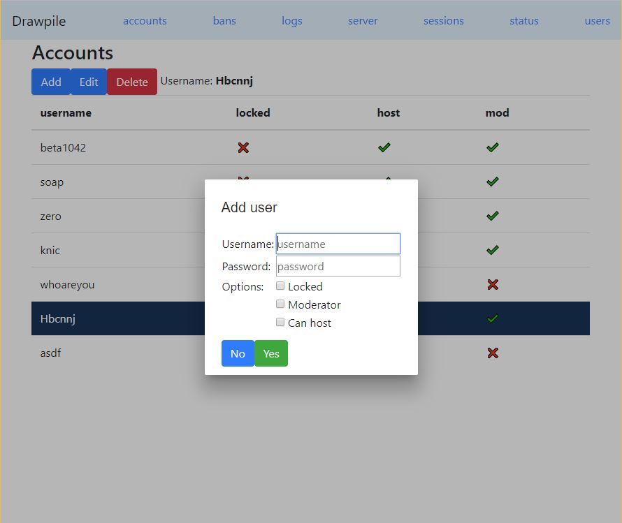

# DrawpileAdmin

This project was generated with [Angular CLI](https://github.com/angular/angular-cli) version 6.0.0.

## Demonstration site
You can go to https://knicknic.github.io/drawpile-admin-test to test out the website.

## How to use

The easiest way to use this project is to use the already hosted version at https://knicknic.github.io/drawpile-admin . This page however expects specific naming patterns.
* [some_domain or ip:port]/ -> https://knicknic.github.io/drawpile-admin 
* [some_domain or ip:port]/rpc/ -> yourdrawpile server

I use [traefik](https://traefik.io) to accomplish this redirection. I use [duckdns](https://www.duckdns.org) to have free domains/subdomains (useful if you want to access over the internet). [Traefik](https://traefik.io) has built in plugins to get certificates for https from [letsencrypt](https://letsencrypt.org).

**See example in [./traefik](./traefik)**

## Status
This was last tested against [Drawpile 2.0.10](https://github.com/drawpile/Drawpile/tree/2.0.10). As of that time it was mostly complete, lacking a few features. 
* Listing server support in sessions
* Time to choose ban expiration
* log purge duration in server
* HTML display is not pretty

Full list at https://github.com/KnicKnic/drawpile-admin-frontend/projects/1

## Development server

Run `ng serve` for a dev server. Navigate to `http://localhost:4200/`. The app will automatically reload if you change any of the source files.

## Code scaffolding

Run `ng generate component component-name` to generate a new component. You can also use `ng generate directive|pipe|service|class|guard|interface|enum|module`.

## Build

Run `ng build` to build the project. The build artifacts will be stored in the `dist/` directory. Use the `--prod` flag for a production build.

## Running unit tests

Run `ng test` to execute the unit tests via [Karma](https://karma-runner.github.io).

## Running end-to-end tests

Run `ng e2e` to execute the end-to-end tests via [Protractor](http://www.protractortest.org/).

## Further help

To get more help on the Angular CLI use `ng help` or go check out the [Angular CLI README](https://github.com/angular/angular-cli/blob/master/README.md).
